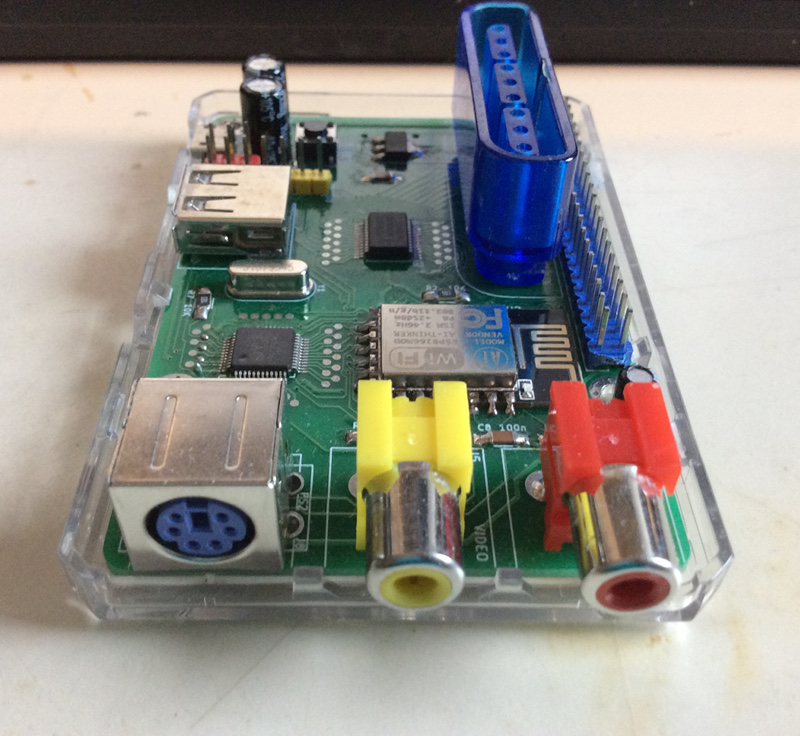

# BASIC Engine PCB

KiCAD schematics and PCB layout for the BASIC Engine home computer.

- ESP8266 SoC
- VS23S010 video controller with PAL and NTSC output
- 5-bit PCM sound
- MicroSD card slot
- PS/2 and PS/2-compatible USB keyboard interface
- PlayStation controller port
- PCF8575 I/O extender with 16 GPIO pins
- I2C bus
- power supplied via Micro-USB socket or pin header

Gerber files for ordering PCBs can be found in the
[release section](https://github.com/uli/basicengine-pcb/releases)

